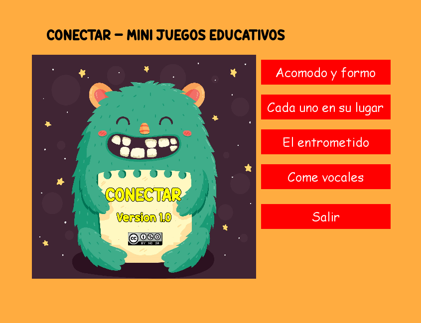

# ¿Que es conectar?

_Conectar es una aplicación interactiva para niños con mini juegos educativos._

## Conectar está en desarrollo 🚀

 

### Pre-requisitos 📋

_Conectar es multiplataforma, pero necesitas tener instalado Python 3.x y Pygame para poder correrlo._

## Construido con 🔧

_Todo lo que usé :)_

* [Python](https://www.python.org) - Desarrollado en Python
* [Pygame](https://www.pygame.org/docs/) - Libreria Pygame
* [Freepik](https://www.freepik.es/) - Imagenes 
* [Freesound](https://freesound.org/browse/) - Sonidos
* [Youtube Library Sound](https://www.youtube.com/audiolibrary/music) - Musica de fondo
* [Lujan Rojas](http://github.com/dracaster) - Voz femenina

## Contribuyendo 📌

Si queres aportar tu granito de arena a este proyecto, por favor enviame un mail a: **lujanrojas.informatica@gmail.com**

## Autora ✒️

_Idea, desarrollo, documentación._

* **Luján Rojas** - [Email](lujanrojas.informatica@gmail.com)

## Licencia 📄

 Este trabajo está bajo una licencia <a rel="license" href="http://creativecommons.org/licenses/by-nc-sa/4.0/">Creative Commons Attribution-NonCommercial-ShareAlike 4.0 International License</a>.

## Agradecimientos 🎁

* A los niños y niñas que enseño computación, que me inspiran a hacer estas cosas❤️.
* A los que me alientan dia a dia a seguir aportando a la educación 📢

---
Hecho con mucho ❤️ para todo mundo, en especial para los niños y niñas a los que enseño computación.😊
